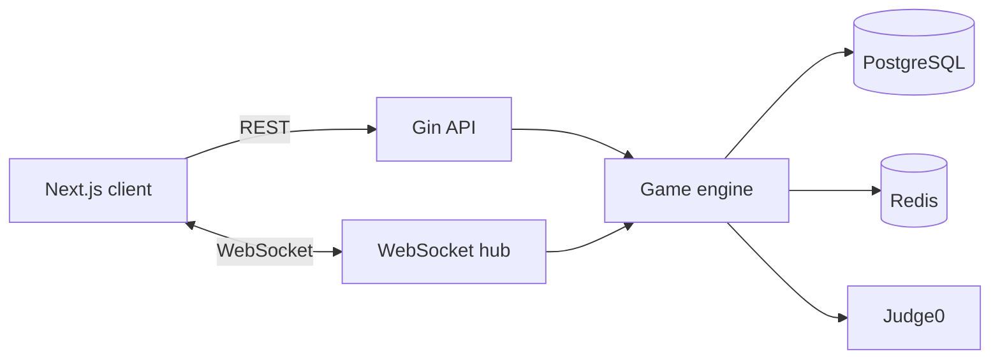

# CodeRacer

Real-time coding races with matchmaking, live code evaluation, persistent sessions, and competitive rankings.

[](https://coderacer.codes)
[](https://go.dev/)
[](https://nextjs.org/)
[](https://react.dev/)

## Overview

CodeRacer is a full-stack competitive programming platform. Players can practice alone or enter real-time PvP matches, write function-based solutions in the browser, and receive per-test-case results from Judge0.

The application is designed around reliable game sessions: a user can participate in only one unfinished match at a time, temporary disconnects can be recovered, and completed matches retain the winning code and execution metrics.

## Features

### Gameplay

- Casual, ranked, and solo game modes
- Difficulty-based matchmaking for Easy, Medium, and Hard problems
- Real-time game state and code synchronization over WebSocket
- JavaScript, Python, and Go submissions
- Function templates generated from each problem's I/O schema
- Judge0-backed test execution with time and memory results
- Elo-style rating updates for ranked matches
- Saved winning solution, language, execution time, and memory usage

### Session reliability

- Database-enforced single active match per user
- Automatic active-match detection when a player returns
- Five-minute reconnection grace period after disconnecting
- PvP matches resolve as a draw when a disconnected player does not return in time
- Explicit confirmation before leaving an active game

### Product

- Email/password, Google, and GitHub authentication
- Short-lived access tokens with rotating HTTP-only refresh-token sessions
- Player profiles, follow relationships, match history, and leaderboard
- Community posts, threaded comments, and voting
- Responsive game room and dashboard
- Admin problem and user management
- Search metadata, structured data, sitemap, and robots configuration

## Architecture



The backend exposes a transport-independent `GameEngine` interface. HTTP controllers and the WebSocket service call this facade instead of coupling directly to persistence, Redis, or the judge implementation.

## Tech stack

| Layer | Technologies |
| --- | --- |
| Frontend | Next.js 16, React 19, TypeScript, Tailwind CSS 4, Radix Themes |
| Client state | TanStack Query, Zustand, React Hook Form |
| Editor | CodeMirror 6 |
| Backend | Go 1.27, Gin, GORM, Gorilla WebSocket |
| Data | PostgreSQL 14, Redis 7 |
| Execution | Judge0 through RapidAPI |
| Infrastructure | Docker, Google Cloud Run, Artifact Registry, Terraform, GitHub Actions |

## Getting started

### Prerequisites

- Go 1.27.1 or newer
- Node.js 20.9 or newer
- Docker with Docker Compose
- A Judge0 RapidAPI key

OAuth credentials are optional. Google and GitHub login are disabled independently when their variables are not configured.

### 1. Start PostgreSQL and Redis

```bash
cd backend
docker compose up -d postgres redis
```

The local services use these defaults:

- PostgreSQL: `localhost:5432`
- Redis: `localhost:6379`
- Database: `code_racer`
- Database user/password: `postgres` / `postgres`

### 2. Configure and run the backend

```bash
cd backend
cp env.example .env
go mod download
go run ./cmd/api
```

At minimum, update `JWT_SECRET` to a random value of at least 32 characters and provide `JUDGE0_API_KEY` in `backend/.env`.

In development mode the backend automatically applies the current GORM schema and inserts the starter problems when the problem table is empty. The API runs at `http://localhost:8080`.

Check the service and its dependencies:

```bash
curl http://localhost:8080/health
```

Swagger UI is available outside release mode at `http://localhost:8080/swagger/index.html`.

### 3. Configure and run the frontend

Create `frontend/.env.local`:

```dotenv
NEXT_PUBLIC_API_URL=http://localhost:8080/api
NEXT_PUBLIC_WS_URL=ws://localhost:8080/ws
NEXT_PUBLIC_SITE_URL=http://localhost:3000
```

Then install dependencies and start the development server:

```bash
cd frontend
npm ci
npm run dev
```

Open `http://localhost:3000`.

## Configuration

### Backend

| Variable | Required | Default | Purpose |
| --- | --- | --- | --- |
| `DB_HOST` | Yes | — | PostgreSQL host |
| `DB_USER` | Yes | — | PostgreSQL user |
| `DB_PASSWORD` | Yes | — | PostgreSQL password |
| `DB_NAME` | Yes | — | PostgreSQL database |
| `DB_PORT` | No | `5432` | PostgreSQL port |
| `REDIS_HOST` | Yes | — | Redis host |
| `REDIS_PORT` | No | `6379` | Redis port |
| `REDIS_USERNAME` | No | `default` | Redis username |
| `REDIS_PASSWORD` | No | Empty | Redis password |
| `JWT_SECRET` | Yes | — | JWT signing key; minimum 32 characters |
| `JUDGE0_API_KEY` | Yes | — | Judge0 RapidAPI key |
| `JUDGE0_API_ENDPOINT` | No | Judge0 CE RapidAPI URL | Judge0 endpoint |
| `PORT` | No | `8080` | HTTP server port |
| `FRONTEND_URL` | No | — | Primary allowed frontend origin |
| `CORS_ALLOWED_ORIGINS` | No | — | Additional comma-separated origins |
| `GIN_MODE` | No | Debug mode | Set to `release` in production |
| `SQL_DEBUG` | No | `false` | Enable GORM query logs in development |

OAuth providers require all three variables in their respective group:

```dotenv
GOOGLE_CLIENT_ID=
GOOGLE_CLIENT_SECRET=
GOOGLE_REDIRECT_URL=http://localhost:3000/api/auth/google/callback

GH_CLIENT_ID=
GH_CLIENT_SECRET=
GH_REDIRECT_URL=http://localhost:3000/api/auth/github/callback
```

### Frontend

| Variable | Required | Default | Purpose |
| --- | --- | --- | --- |
| `NEXT_PUBLIC_API_URL` | No | `http://localhost:8080/api` | REST API base URL |
| `NEXT_PUBLIC_WS_URL` | No | Derived from the API URL | WebSocket base URL including `/ws` |
| `NEXT_PUBLIC_WS_HOST` | No | Production backend host | Production WebSocket host override |
| `NEXT_PUBLIC_SITE_URL` | No | `https://coderacer.codes` | Canonical and sitemap base URL |

Never commit real secrets or production credentials. Use environment-specific secret storage for deployed environments.

## Project structure

```text
.
├── backend/
│   ├── cmd/api/                  # Application composition and entry point
│   ├── internal/
│   │   ├── controller/           # HTTP and WebSocket adapters
│   │   ├── game/                 # Game commands and result types
│   │   ├── interfaces/           # Application-facing contracts
│   │   ├── service/              # Game, auth, judge, and community logic
│   │   ├── repository/           # PostgreSQL persistence
│   │   ├── judge/                # Judge0 client and language wrappers
│   │   ├── events/               # In-process game events
│   │   ├── middleware/           # Authentication and authorization
│   │   └── model/                # Database and response models
│   ├── migrations/               # Versioned SQL migrations
│   ├── deployment/               # Cloud Run and Terraform assets
│   └── docker-compose.yml         # Local PostgreSQL and Redis
└── frontend/
    ├── src/
    │   ├── pages/                 # Next.js Pages Router routes
    │   ├── components/            # Feature and shared UI components
    │   ├── hooks/                 # Auth, matchmaking, and data hooks
    │   ├── lib/                   # API, WebSocket, SEO, and utilities
    │   ├── stores/                # Zustand stores
    │   └── types/                 # Shared TypeScript types
    └── public/                    # Static assets and crawler files
```

## Development commands

### Backend

```bash
cd backend

go test ./...                     # Run the complete test suite
go test -race ./...               # Run with race detection
make test-coverage-report         # Generate coverage.html
go build ./cmd/api                # Compile the API
```

Local SQL migrations can be managed with [golang-migrate](https://github.com/golang-migrate/migrate):

```bash
make local-migrate-up
make local-migrate-version
make migrate-new name=describe_change
```

### Frontend

```bash
cd frontend

npm run lint
npm test
npm run build
```

## API overview

- `GET /health` — database and Redis health
- `/api/auth/*` — registration, login, OAuth, refresh, and logout
- `/api/matches/*` — active match lookup, solo matches, submissions, and closing
- `/api/problems/*` — problem queries and admin CRUD
- `/api/users/*` — profiles, leaderboard, and follows
- `/api/community/*` — posts, comments, and votes
- `WS /ws/matching` — PvP matchmaking
- `WS /ws/:matchId` — live game session

Most `/api` endpoints require authentication. Problem mutations, user administration, and community moderation require the `admin` role.

## Deployment

Pushes affecting `backend/**` run the backend test suite, build a Docker image, publish it to Google Artifact Registry, and deploy the image to Cloud Run through GitHub Actions.

Production mode requires `GIN_MODE=release`, explicit allowed origins, TLS-enabled PostgreSQL, managed secrets, and production OAuth callback URLs. Apply versioned SQL migrations before deploying schema-dependent backend changes.

## Links

- [Live site](https://coderacer.codes)
- [Issue tracker](https://github.com/Dongmoon29/code_racer/issues)
