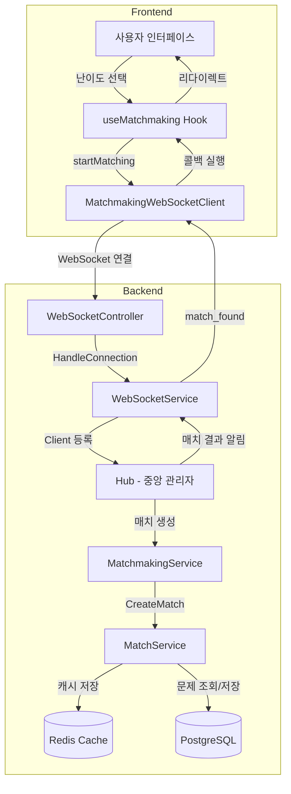
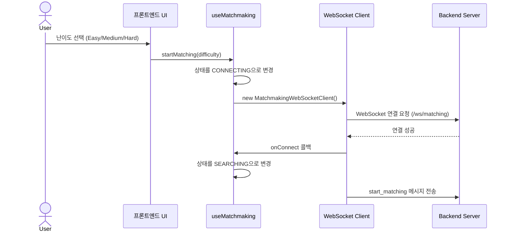
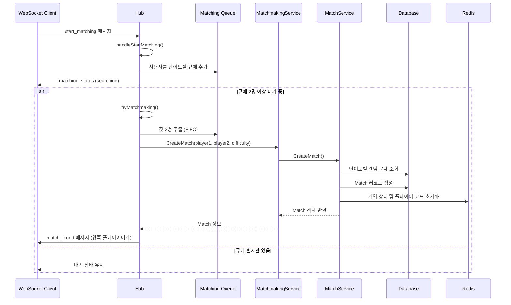
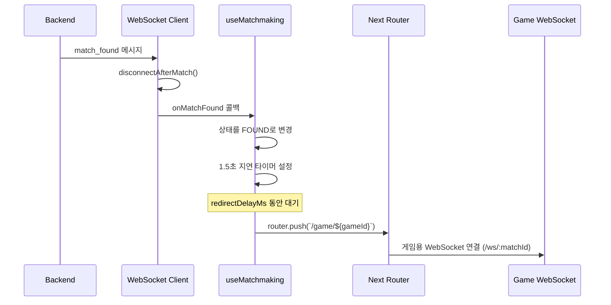
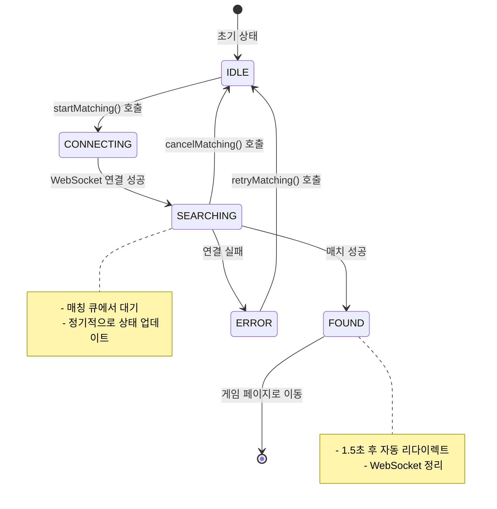
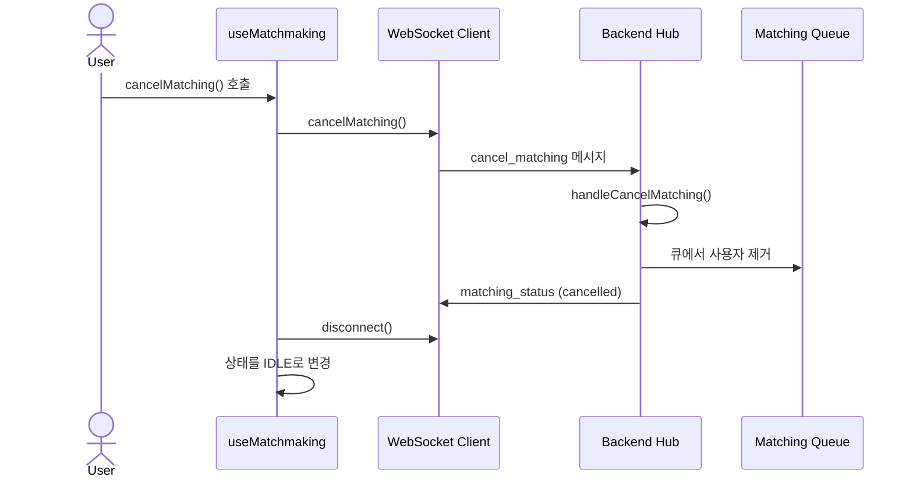

# 매치메이킹 프로세스 플로우

## 전체 아키텍처



## 상세 플로우

### 1. 매치메이킹 시작



### 2. 백엔드 매칭 처리



### 3. 매치 성공 후 처리



### 4. 상태 관리



### 5. 매칭 취소 플로우



## 주요 컴포넌트 설명

### Frontend

1. **useMatchmaking Hook** (`/frontend/src/hooks/useMatchmaking.ts`)
   - 매칭 상태 관리 (IDLE, CONNECTING, SEARCHING, FOUND, ERROR)
   - WebSocket 클라이언트 생성 및 관리
   - 자동 정리 (라우트 변경, 탭 종료, 백그라운드 전환 시)

2. **MatchmakingWebSocketClient** (`/frontend/src/lib/matchmaking-websocket.ts`)
   - 매칭 전용 WebSocket 연결 관리
   - 재연결 로직 (최대 3회, 지수 백오프)
   - 메시지 송수신 처리

### Backend

1. **WebSocketController** (`/backend/internal/controller/websocket_controller.go`)
   - WebSocket 연결 요청 처리
   - JWT 인증 검증
   - 매칭용 특수 UUID 할당 (00000000-0000-0000-0000-000000000000)

2. **Hub** (`/backend/internal/service/websocket_service.go`)
   - 모든 WebSocket 클라이언트 중앙 관리
   - 난이도별 매칭 큐 관리 (`matchingClients map[string][]*Client`)
   - FIFO 방식 매칭 (큐의 첫 2명)
   - 메시지 브로드캐스팅

3. **MatchmakingService** (`/backend/internal/service/matchmaking_service.go`)
   - 매치 생성 조율
   - MatchService에 위임

4. **MatchService** (`/backend/internal/service/match_service.go`)
   - 난이도별 랜덤 문제 선택
   - Match 레코드 DB 저장
   - Redis에 게임 상태 및 플레이어 코드 초기화

## 데이터 구조

### Redis 키 구조
```
match:{matchID}                              # 게임 상태
match:{matchID}:user:{userID}:code          # 플레이어 코드
match:{matchID}:users                        # 게임 참가자 Set
match:{matchID}:winner_lock                  # 승자 결정 분산 락
```

### WebSocket 메시지 타입
```typescript
// 클라이언트 → 서버
- start_matching: { type, difficulty }
- cancel_matching: { type }

// 서버 → 클라이언트
- matching_status: { type, status, queue_position?, wait_time_seconds? }
- match_found: { type, game_id, problem, opponent }
```

## 에러 처리 및 엣지 케이스

1. **연결 실패**: 최대 3회 재연결 시도 (지수 백오프)
2. **동시 제출**: Redis 분산 락으로 승자 결정
3. **중복 큐 등록**: 기존 항목 제거 후 재등록
4. **매치 후 연결 해제**: `disconnectAfterMatch` 플래그로 큐 정리 방지
5. **자동 정리**: 라우트 변경, 탭 종료, 백그라운드 전환 시 자동 취소
